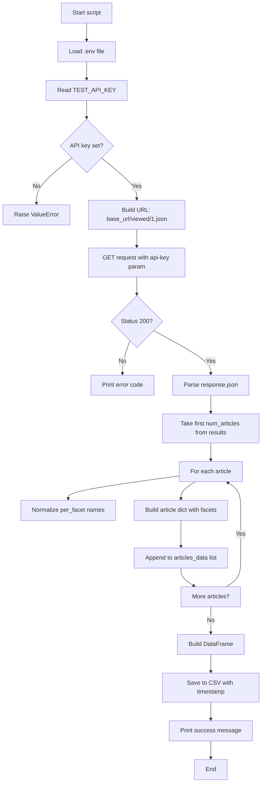

# API Query Documentation

## 📋 Project Overview

This document describes **`query_nyapi.py`**, a Python script that fetches the **most viewed** New York Times articles from the [NYT Most Popular API](https://developer.nytimes.com/docs/most-popular-product/1/overview). The script loads your API key from a `.env` file, requests article data (including facets for people, organizations, locations, and topics), normalizes person names for display, and saves the results to a timestamped CSV file. It supports the broader project goal of building a facet-aware reporter and RAG pipeline using NYT article metadata.

---

## 🔗 API Endpoint(s) and Parameters

The script uses the **New York Times Most Popular API**, version 2.

| Item | Value |
|------|--------|
| **Base URL** | `https://api.nytimes.com/svc/mostpopular/v2` |
| **Endpoint used** | `GET /viewed/{period}.json` |
| **Period** | `1` = last 24 hours (other options: `7` = 7 days, `30` = 30 days) |

### Request

- **Method:** `GET`
- **URL example:** `https://api.nytimes.com/svc/mostpopular/v2/viewed/1.json`
- **Query parameters:**

| Parameter | Required | Description |
|-----------|----------|-------------|
| `api-key` | Yes | Your NYT API key (stored in `.env` as `TEST_API_KEY`) |

Example with `requests`:

```python
url = "https://api.nytimes.com/svc/mostpopular/v2/viewed/1.json"
params = {"api-key": API_KEY}
response = requests.get(url, params=params)
```

No request body is sent; authentication is via the query parameter only.

---

## 📊 Request and Response Data Structure

### Request

- **HTTP method:** GET  
- **Body:** None  
- **Query string:** `api-key=<your_key>`

### Response (high level)

The API returns JSON with at least:

| Field | Type | Description |
|-------|------|-------------|
| `status` | string | e.g. `"OK"` |
| `copyright` | string | Copyright notice |
| `num_results` | integer | Total number of results |
| `results` | array | List of article objects |

### Each object in `results`

| Field | Type | Description |
|-------|------|-------------|
| `title` | string | Article headline |
| `published_date` | string | Publication date (e.g. `"2025-02-22"`) |
| `section` | string | Section name |
| `url` | string | Article URL |
| `abstract` | string | Short summary |
| `des_facet` | array of strings | Descriptor/topic facets |
| `org_facet` | array of strings | Organization facets |
| `per_facet` | array of strings | People (format `"Last, First"` in API) |
| `geo_facet` | array of strings | Geographic facets |

The script converts `per_facet` from `"Last, First"` to `"First Last"` for display and stores both list and comma-separated string versions for CSV/JSON output.

### Script output (CSV columns)

The script writes a CSV with one row per article (up to `num_articles`). Columns include:

| Column | Description |
|--------|-------------|
| `title` | Article title |
| `published_date` | Publication date |
| `section` | Section |
| `url` | Article URL |
| `abstract` | Abstract text |
| `des_facet` | Descriptor facets (comma-separated) |
| `org_facet` | Organization facets (comma-separated) |
| `per_facet` | People (comma-separated, normalized to "First Last") |
| `geo_facet` | Geographic facets (comma-separated) |

---

## 🔄 API Workflow Diagram



---

## 🚀 Usage Instructions

### Prerequisites

- **Python 3** (script uses `requests`, `pandas`, `os`, `json`, `datetime`).
- A **New York Times API key** (sign up at [NYT Developer](https://developer.nytimes.com/) and get a key for the Most Popular API).

### Dependencies

Install required packages:

```bash
pip install requests pandas
```

No `python-dotenv` is required; the script loads `.env` with a small custom loader.

### Setup

1. **Create a `.env` file** in the same directory as `query_nyapi.py` (project root).
2. **Add your API key** (use the same variable name the script expects):

   ```env
   TEST_API_KEY=your_nyt_api_key_here
   ```

3. **Optional:** Ensure `.env` is in `.gitignore` so the key is not committed.

### Running the script

From the project root (where `query_nyapi.py` lives):

```bash
python query_nyapi.py
```

By default, `main()` calls `query_nyt_api(num_articles=2)`. To change how many articles are fetched, edit the `num_articles` argument in the `main()` function (e.g. `query_nyt_api(num_articles=20)`).

### Output

- **Console:** For each article, the script prints title, date, section, facets, abstract snippet, and URL.
- **File:** A CSV file named like `nyt_articles_YYYYMMDD_HHMMSS.csv` is written in the current directory with the columns described above.

### Common issues

| Issue | What to do |
|-------|------------|
| `TEST_API_KEY not found in .env file` | Create `.env` in the script’s directory and add `TEST_API_KEY=...`. |
| `Error: 401` | Invalid or missing API key; check `.env` and key validity in NYT developer portal. |
| `Error: 429` | Rate limit hit; wait and retry, or use a higher-tier key if available. |

---

## 📝 Notes

- The script uses **Most Popular v2** “viewed” with period `1` (last 24 hours). You can change the path to `viewed/7.json` or `viewed/30.json` for longer windows.
- Person names in `per_facet` are normalized from NYT’s `"Last, First"` format to `"First Last"` for readability.
- CSV filenames include a timestamp so each run does not overwrite previous exports.

---

## 🔗 Additional Resources

- [NYT Most Popular API overview](https://developer.nytimes.com/docs/most-popular-product/1/overview)
- [LAB: Develop a Meaningful API Query](01_query_api/LAB_your_good_api_query.md) — context and tasks for this style of API query
